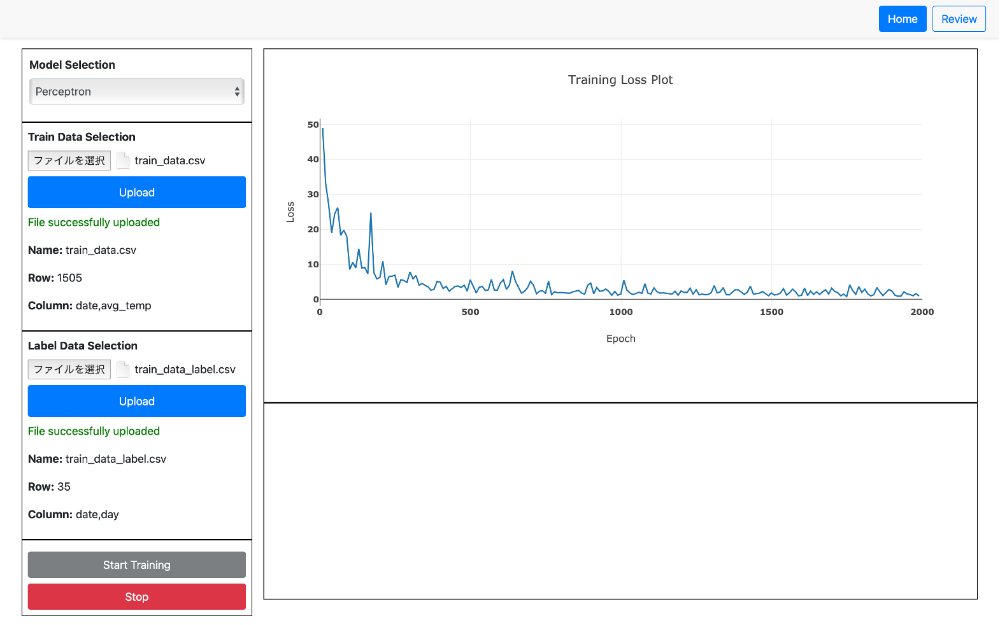

# MachineLearningEasier

## 1. Introduction 

In this project, I deploy an AI model on a website. It allows users to train and validate the model without writing any code—just a few clicks. Moreover, it also visualizes the model's training loss.

## 2. WEB UI Layout
As you can see, the website has two main parts: the left side is used for model settings, and the right side is for visualization.

### 1. Model Settings
Users can select a model to train. In this project, only the Perceptron model is available. After selecting the model, users need to upload training and validation data (with labels) following the specified format. Finally, clicking the Start button will begin the training process.

### 2. Visualization
The right side displays a visualization of the training loss.
The x-axis represents the training loss value—lower is better.
The y-axis represents the number of epochs.
Training continues until it reaches the specified number of epochs or the loss stops decreasing.

## 3. Backend
The web server was built using Flask, with the Perceptron model implemented in PyTorch.
Socket.IO is used to send the model's training loss in real time, enabling live visualization during training.

## 4. Frontend
The frontend is built using HTML, CSS, and JavaScript to create an interactive and responsive user interface.

### Real-Time Visualization with Plotly
The training loss is visualized using Plotly.js, a powerful JavaScript charting library.
As the model trains, Socket.IO receives real-time updates from the backend and dynamically updates the Plotly graph.
The graph shows:
    X-axis: Training loss values (lower is better)
    Y-axis: Epoch number
This allows users to monitor the model’s performance as training progresses.